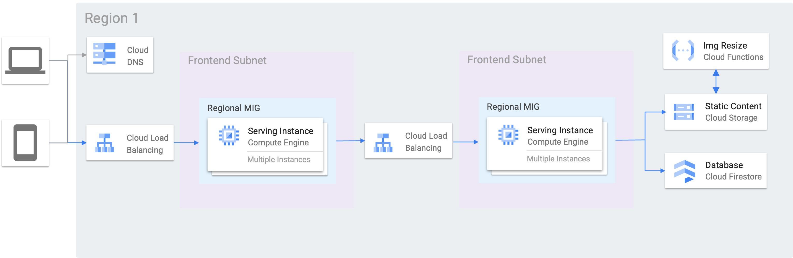

## Segment 2: Designing Network, Storage, and Compute
Resources for segment 2 of the course.

### Demo
#### Requirements
- Regional 3-tier web app
- IaaS Compute with Debian Linux
- A document database
- Object storage for images
- Event-driven processing for new images (image resizing)

#### Design

### Segment Resources
- [Load balancer decision tree](https://cloud.google.com/load-balancing/docs/choosing-load-balancer)
- [Network service tiers](https://cloud.google.com/network-tiers/docs/overview)
- [Cloud SQL failover](https://cloud.google.com/sql/docs/mysql/high-availability#failover-overview)
- [App Engine Supported Runtimes](https://cloud.google.com/appengine/docs/standard/runtimes)